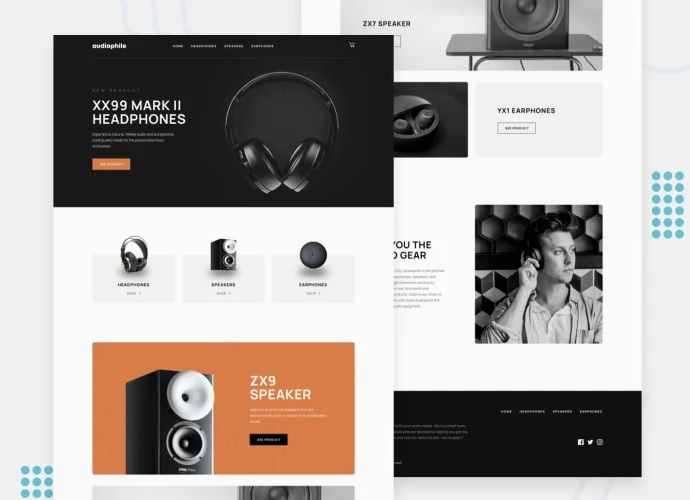
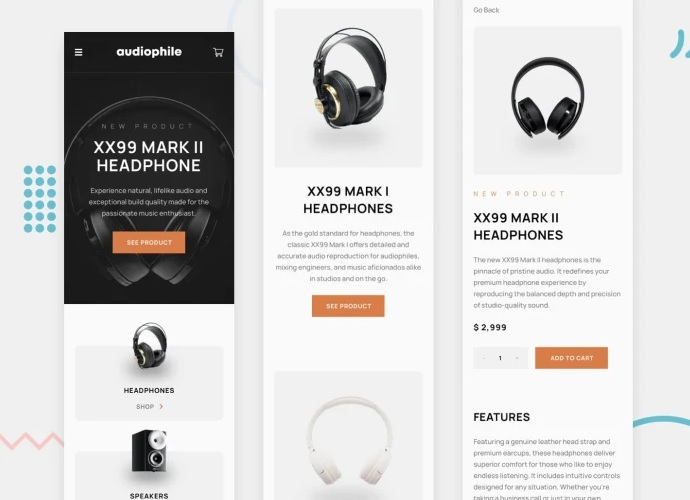

# Frontend Mentor - Audiophile e-commerce website solution

This is a solution to the [Audiophile e-commerce website challenge on Frontend Mentor](https://www.frontendmentor.io/challenges/audiophile-ecommerce-website-C8cuSd_wx). Frontend Mentor challenges help you improve your coding skills by building realistic projects. 

## Table of contents

- [Overview](#overview)
  - [The challenge](#the-challenge)
  - [Screenshot](#screenshot)
  - [Links](#links)
- [My process](#my-process)
  - [Built with](#built-with)
  - [What I learned](#what-i-learned)
- [Author](#author)

## Overview

### The challenge

Users should be able to:

- View the optimal layout for the app depending on their device's screen size
- See hover states for all interactive elements on the page
- Add/Remove products from the cart
- Edit product quantities in the cart
- Fill in all fields in the checkout
- Receive form validations if fields are missed or incorrect during checkout
- See correct checkout totals depending on the products in the cart
  - Shipping always adds $50 to the order
  - VAT is calculated as 20% of the product total, excluding shipping
- See an order confirmation modal after checking out with an order summary

### Screenshot

### Links

- Live Site URL: [Add live site URL here](https://your-live-site-url.com)

## My process

### Built with

- Semantic HTML5 markup
- CSS custom properties
- Flexbox
- CSS Grid
- Mobile-first workflow
- [React](https://reactjs.org/) - JS library
- [Next.js](https://nextjs.org/) - React framework
- [Tailwind CSS](https://tailwindcss.com/) - CSS Framework
- [Sanity](https://www.sanity.io/) - Headless CMS

### What I learned

- First time using Next.JS for a project. Learned about its server side rendering capabilities, built-in routing,
  and using Context as an alternative to Redux for global state management. Overall positive experience with the
  framework although handling image media queries with javascript isn't as good compared to create-react-app. 
- First time using Tailwind CSS. Frustrating to use at first, but once you get the hang of it, it becomes
  easy to use and preferable to regular CSS. 
- First time using Sanity and headless CMS. Greatly simplified the backend work compared to a Express/MongoDB solution.

## Author

- [My Portfolio](https://antco25.github.io)
